# Divergent Tastes: Mapping the Cultural Distance Between Pitchfork and Billboard (2015–2024)

## Research Goal:
This project investigates how musical reputation is shaped through two distinct lenses—critical acclaim (Pitchfork) and mainstream popularity (Billboard). Through artist frequency, genre presence, temporal patterns, and thematic content, we explore where these two platforms align and diverge in their musical valuation.

## 1. Overview of Alignment and Divergence

Drake and Kendrick Lamar are the clearest cross-platform outliers, topping both Pitchfork and Billboard charts consistently from 2015 to 2024. This suggests a rare convergence of critical and commercial success.

Other artists like Ariana Grande, Taylor Swift, and The Weeknd dominated Billboard lists but had significantly less presence on Pitchfork, highlighting a bias toward pop accessibility over critical edge.

In contrast, Charli XCX, Frank Ocean, Angel Olsen, and Moses Sumney received repeated Pitchfork recognition but were largely absent from Billboard’s top ranks—indicating a critical preference for sonic experimentation and conceptual depth.

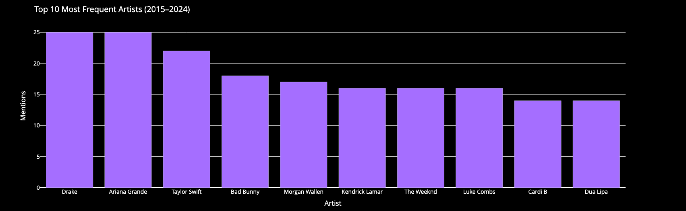

## 2. Year-Specific Divergences (e.g., 2016, 2024)

In 2016, Billboard spotlighted The Weeknd, Adele, and Shawn Mendes, while Pitchfork favored Chance the Rapper, Frank Ocean, and Kanye West. The contrast reflects differing reactions to genre fluidity and artistic boldness.

In 2024, the gap widened: Pitchfork recognized experimental or niche artists such as Mach-Hommy and evilgiane, while Billboard featured more mainstream figures like Billie Eilish and Sabrina Carpenter.

## 3. Temporal Trends (2015–2024)

Billboard’s top mentions over the decade:
• Drake, Ariana Grande, and Taylor Swift dominate with 20+ mentions.

Pitchfork’s top mentions:
• More evenly distributed, with Kendrick Lamar and Drake at the top (10 mentions), and a wider spread among indie and alternative acts.

This distribution reveals Billboard’s loyalty to chart-topping consistency, while Pitchfork spreads attention across more artists, reflecting evolving editorial interests.

### Billboard V.S. Pitchfork:

#### Overall

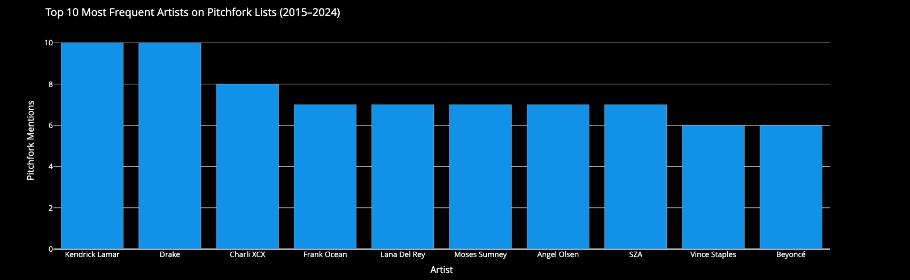
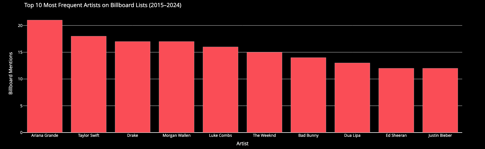

#### 2015

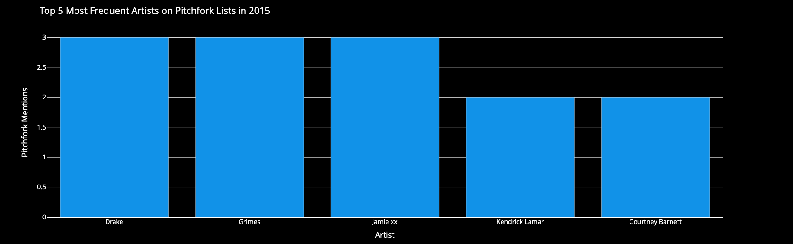
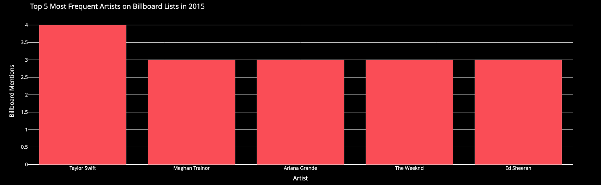

#### 2016

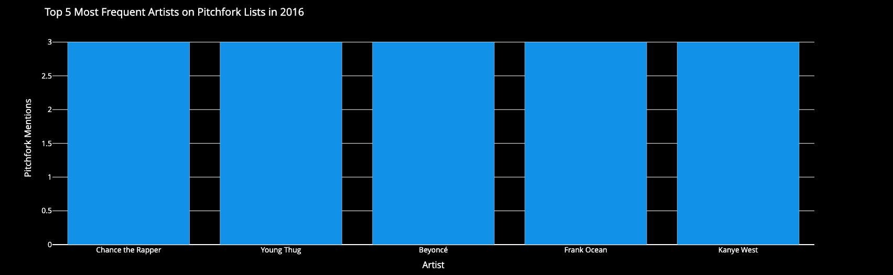
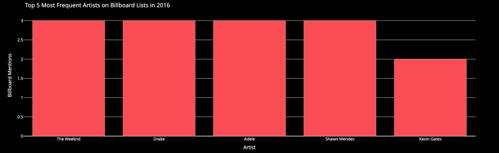

#### 2017

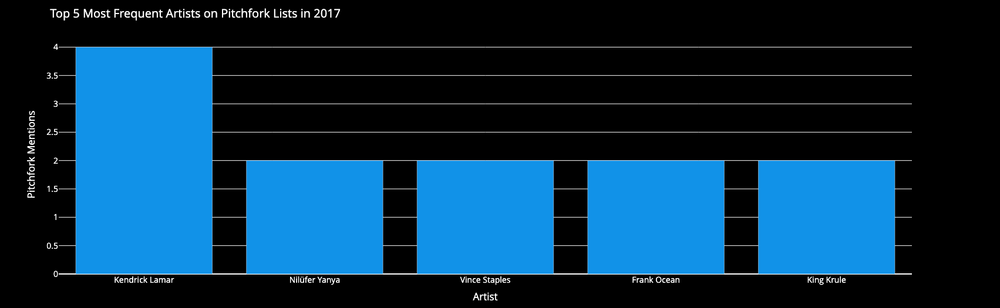
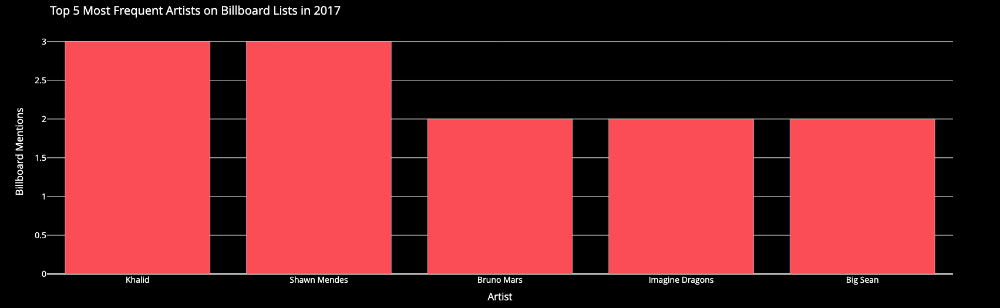

#### 2018

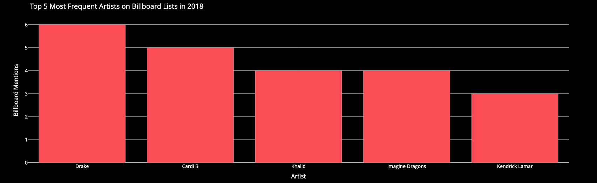

#### 2019

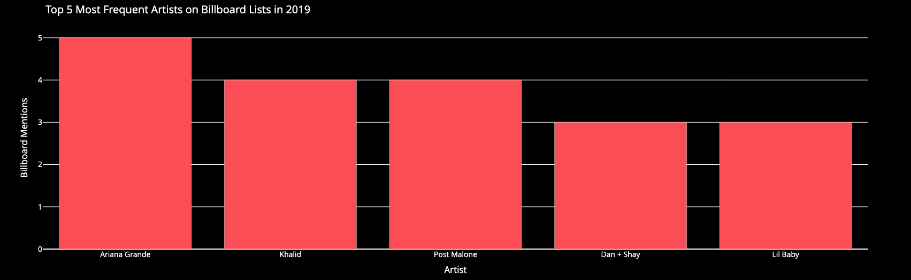

#### 2020

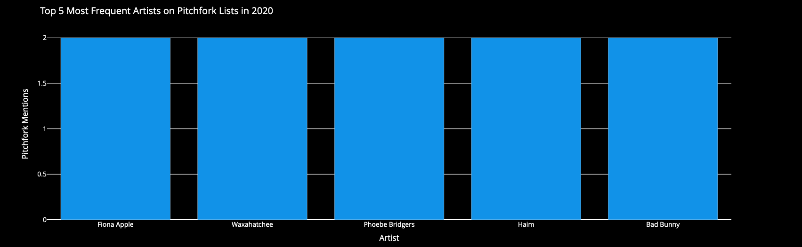
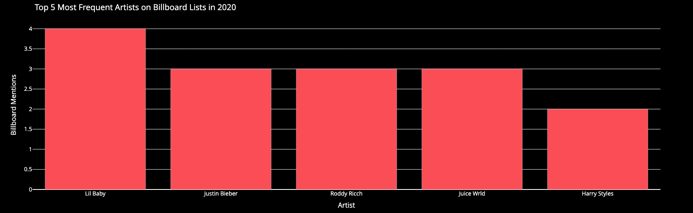

#### 2021

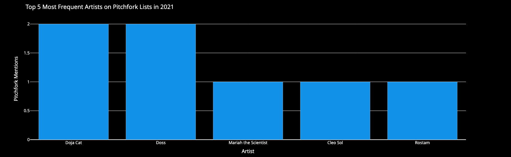
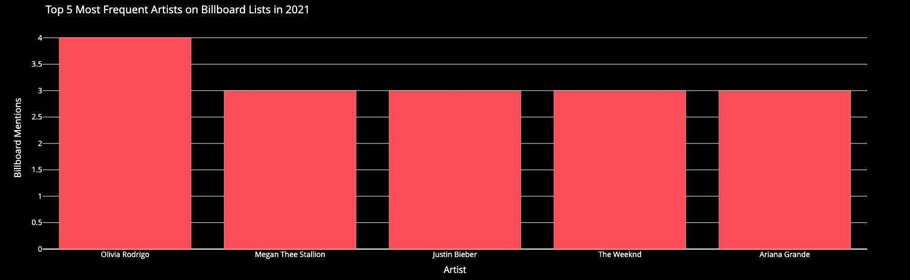

#### 2022

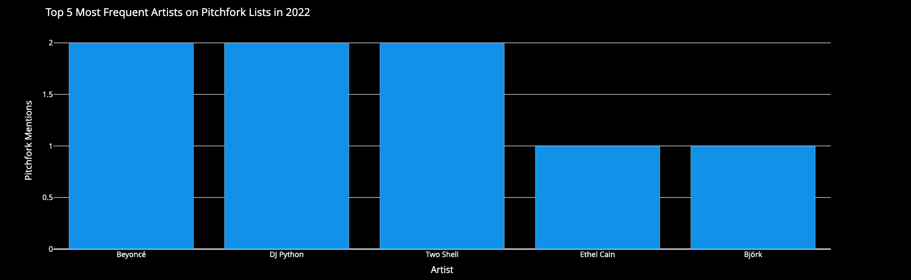
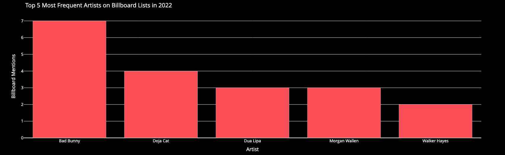

#### 2023

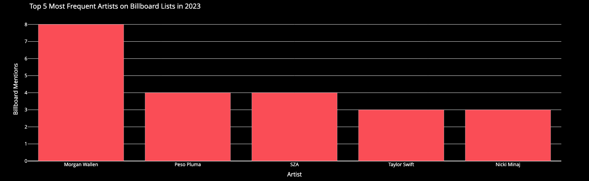

#### 2024

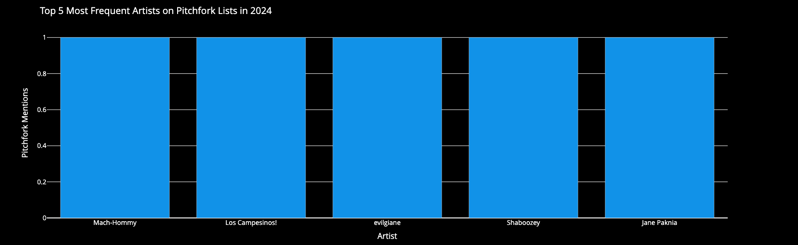
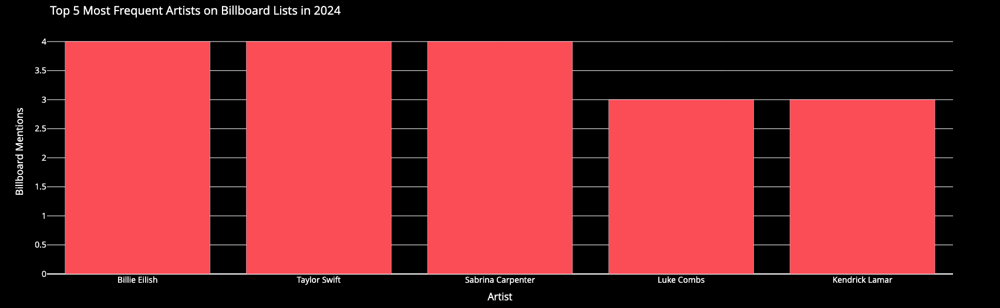

#### INTERSECTION
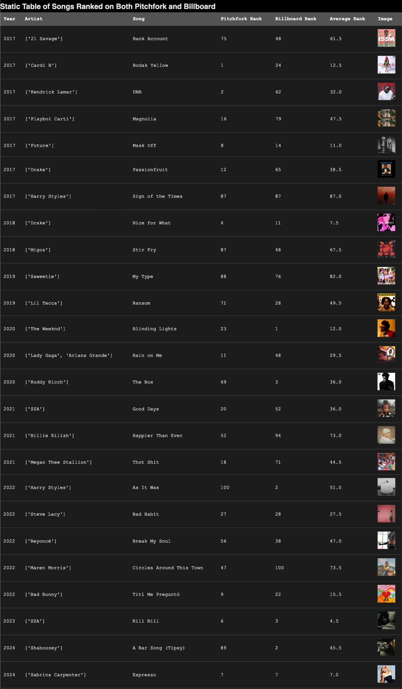

## 4. Cultural Distance in Taste & Values

Pitchfork prioritizes:
 • Innovation, genre blending, emotional intimacy, cultural critique
 • Artists who take risks or push boundaries

Billboard prioritizes:
 • Broad appeal, streaming metrics, radio play, and viral trends
 • Artists with sustained media presence and label support

## 5. Implications

The critical-popular divide isn’t just about taste—it reveals different logics of value: artistic depth vs. market traction.

Artists who bridge both (e.g., Kendrick, Frank Ocean, Billie Eilish) are rare and culturally significant because they navigate both spheres successfully.

For artists and producers, this duality underscores the challenge: Do you want critical legacy or mass reach? Often, they are not the same path.

## 6. Conclusion

Pitchfork and Billboard offer two distinct cultural lenses. Understanding their divergences isn’t just about music—it’s a study in how culture is validated, by either curators or consumers. By mapping the patterns over a decade, this project lays the groundwork for analyzing future shifts in musical value systems—especially as the boundary between underground and mainstream continues to blur in the age of streaming and algorithmic discovery.